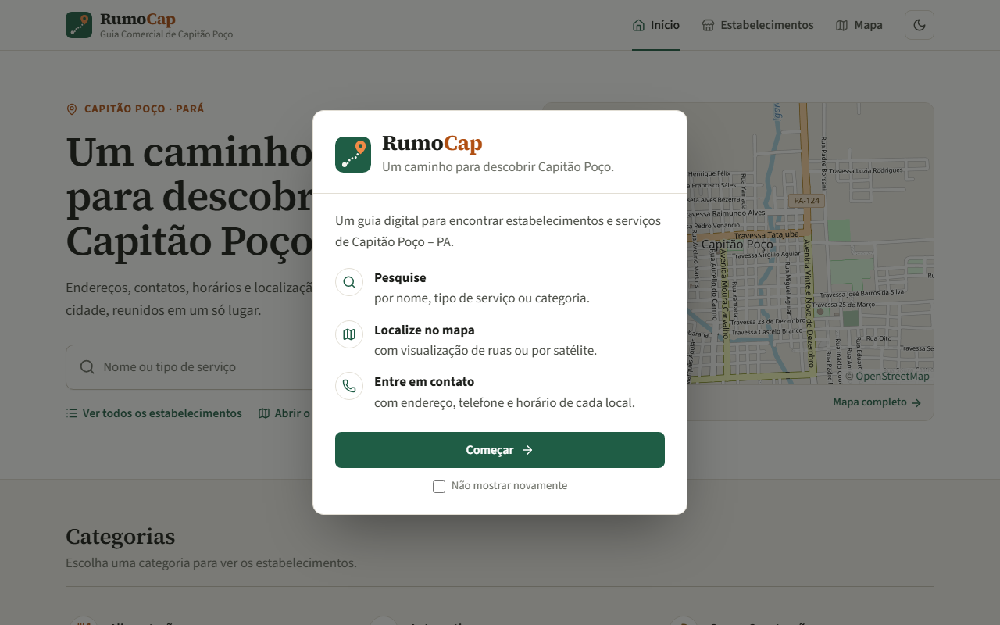
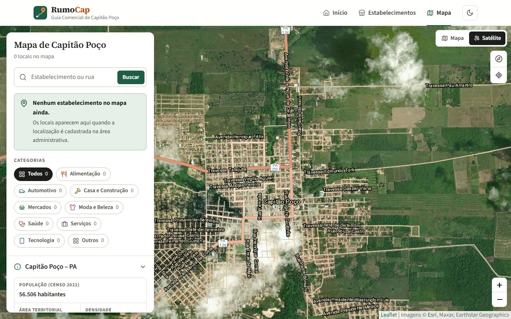
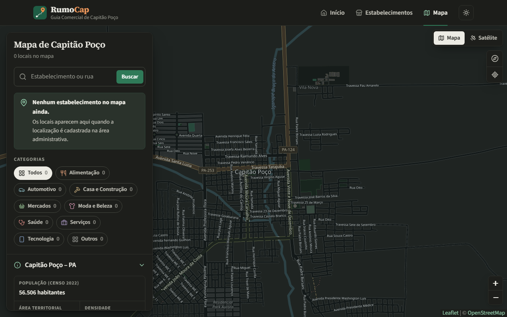

# RumoCap — Guia Comercial de Capitão Poço

[](https://github.com/KaueZuzza/RumoCap/actions/workflows/testes.yml)

**RumoCap** (de *rumo*: caminho, direção; e *Cap*: Capitão Poço) é um guia digital **informativo** sobre
estabelecimentos comerciais e serviços do município de Capitão Poço – PA. O visitante conhece os
estabelecimentos, suas categorias, o que oferecem, o horário de funcionamento, a localização e as formas
de contato.

> Não é um sistema de vendas: não há carrinho, pagamentos, estoque, pedidos ou delivery.
> O banco começa **sem nenhum estabelecimento**: apenas as 9 categorias iniciais. Os dados reais são
> cadastrados pela área administrativa.

<p align="center">
  
  
</p>
<p align="center">
  
  
</p>

## Começando

Pré-requisitos no Windows: **JDK 21** (por exemplo [Eclipse Temurin](https://adoptium.net) ou
[Amazon Corretto](https://aws.amazon.com/corretto/)), **PostgreSQL 18** e **Git**. O Maven não precisa
ser instalado (o projeto traz o Maven Wrapper).

```powershell
git clone https://github.com/KaueZuzza/RumoCap.git
cd RumoCap

# 1. cria o servidor PostgreSQL do projeto (porta 5434), o banco e o arquivo local de senhas
powershell -ExecutionPolicy Bypass -File database\servidor.ps1 criar

# 2. inicia o site (troque pelo caminho do seu JDK 21, se o JAVA_HOME apontar para outra versão)
$env:JAVA_HOME = "C:\caminho\do\jdk-21"
.\mvnw.cmd spring-boot:run
```

Depois acesse http://localhost:8080. O usuário e a senha da área administrativa estão no arquivo
`config/application.properties` gerado no passo 1 (veja *Senhas e configuração*).

## Tecnologias

| Camada | Tecnologia |
|---|---|
| Frontend | HTML, CSS e JavaScript puro (módulos ES), modo claro/escuro, ícones SVG (Lucide e Simple Icons), mapa com Leaflet |
| Mapa | ruas: OpenStreetMap · satélite: Esri World Imagery · pesquisa de ruas: Nominatim · dados do município: API do IBGE |
| Backend | Java 21, Spring Boot 4.0.4, API REST, Spring Security (login da administração) |
| Banco | PostgreSQL 18, JPA/Hibernate, migrations com Flyway |
| Testes | JUnit, MockMvc e H2 em memória (os testes não tocam no PostgreSQL) |

## Estrutura de pastas

```
RumoCap/
├── database/
│   ├── servidor.ps1              cria, liga e desliga o PostgreSQL exclusivo do projeto (porta 5434)
│   └── criar-banco.sql           cria o usuário e o banco "rumocap"
├── docs/img/                     capturas de tela usadas neste README
├── src/
│   ├── main/
│   │   ├── java/br/com/rumocap/
│   │   │   ├── RumoCapApplication.java
│   │   │   ├── config/           segurança, publicação das imagens e configurações
│   │   │   ├── controller/       endpoints REST (/api/...)
│   │   │   ├── dto/              dados de entrada e saída da API
│   │   │   ├── exception/        erros e respostas padronizadas
│   │   │   ├── model/            entidades JPA (Categoria, Estabelecimento)
│   │   │   ├── repository/       acesso ao banco (Spring Data JPA)
│   │   │   ├── service/          regras de negócio e gravação das imagens
│   │   │   └── util/             busca sem acentos e ordem alfabética
│   │   └── resources/
│   │       ├── application.properties
│   │       ├── db/migration/     V1 (tabelas) e V2 (categorias iniciais)
│   │       └── static/           frontend
│   │           ├── index.html               página inicial
│   │           ├── estabelecimentos.html    lista com pesquisa e filtro
│   │           ├── estabelecimento.html     detalhes (?id=)
│   │           ├── mapa.html                mapa
│   │           ├── admin.html               área administrativa
│   │           ├── css/                     estilo.css e admin.css
│   │           ├── js/                      api.js, comum.js, tema.js (claro/escuro), abertura.js
│   │           │                            (carregamento e apresentação), municipio.js (IBGE) e um script por página
│   │           ├── fontes/                  Source Serif 4 e Source Sans 3 (licença OFL)
│   │           ├── img/                     logo.svg e icones.svg
│   │           └── vendor/leaflet/          biblioteca do mapa
│   └── test/                     testes automatizados
├── config/                       application.properties.example (modelo); o application.properties
│                                 local, com as senhas, não vai para o Git
├── uploads/                      imagens enviadas (criada automaticamente)
├── mvnw, mvnw.cmd, .mvn/         Maven Wrapper (não é preciso instalar o Maven)
├── pom.xml                       dependências e build (Maven)
├── .github/workflows/testes.yml  compila e roda os testes no GitHub a cada envio
├── .gitignore
└── README.md
```

## Banco de dados (PostgreSQL)

O RumoCap tem um **servidor PostgreSQL só dele**, separado dos bancos de outros projetos:

| Item | Valor |
|---|---|
| Endereço | `localhost`, porta **5434** (aceita conexões somente deste computador) |
| Banco | `rumocap` |
| Usuário da aplicação | `rumocap` (dono do banco, sem privilégios de superusuário) — senha aleatória em `config/application.properties` |
| Superusuário | `postgres` — a senha aleatória está em `%LOCALAPPDATA%\RumoCap\superusuario.txt` |
| Arquivos do servidor | `%LOCALAPPDATA%\RumoCap\pgdata` (log em `%LOCALAPPDATA%\RumoCap\postgres.log`) |
| Início automático | atalho *RumoCap - PostgreSQL* na pasta Inicializar do Windows |

Para criá-lo (com o PostgreSQL 18 instalado; se a pasta `bin` for outra, informe-a com `-PostgresBin`):

```powershell
powershell -ExecutionPolicy Bypass -File database\servidor.ps1 criar
```

O `criar` também gera o arquivo local **`config/application.properties`** com senhas aleatórias para o
usuário `rumocap` do banco e para a área administrativa (veja *Senhas e configuração*).

Outros comandos do mesmo script: `iniciar`, `parar` e `status`
(ex.: `powershell -ExecutionPolicy Bypass -File database\servidor.ps1 status`).

As **tabelas não são criadas à mão**: ao iniciar, a aplicação executa as migrations do Flyway
(`src/main/resources/db/migration`), que criam as tabelas `categoria` e `estabelecimento` e inserem as
9 categorias iniciais.

```
categoria (id, nome)
estabelecimento (id, nome, descricao, endereco, contato, horario, latitude, longitude, imagem, categoria_id → categoria.id)
```

**Ver os dados no pgAdmin:** *Register › Server* → Name `RumoCap`; aba *Connection*: Host `localhost`,
Port `5434`, Maintenance database `rumocap`, Username `rumocap`, Password: o valor de `RUMOCAP_DB_PASSWORD`
em `config/application.properties`.

> Quer usar outro servidor PostgreSQL? Execute `database/criar-banco.sql` nele como superusuário
> (`psql ... -v senha_rumocap=<senha> -f database/criar-banco.sql`), coloque a mesma senha em
> `RUMOCAP_DB_PASSWORD` e aponte a aplicação com `RUMOCAP_DB_URL` (ex.: `jdbc:postgresql://localhost:5432/rumocap`).

## Como executar

Pré-requisitos: **JDK 21**, o servidor do banco ligado (ele liga sozinho ao entrar no Windows) e o arquivo
`config/application.properties` (criado pelo `servidor.ps1 criar`).

```powershell
# na pasta do projeto, no PowerShell
$env:JAVA_HOME = "C:\caminho\do\jdk-21"   # só é preciso se o JAVA_HOME apontar para outra versão
.\mvnw.cmd spring-boot:run
```

Quando aparecer `Started RumoCapApplication`, acesse:

| Página | Endereço |
|---|---|
| Site | http://localhost:8080 |
| Estabelecimentos | http://localhost:8080/estabelecimentos.html |
| Mapa | http://localhost:8080/mapa.html |
| Administração | http://localhost:8080/admin.html — usuário e senha em `config/application.properties` |

No IntelliJ ou no VS Code: abra a pasta do projeto, escolha um JDK 21 para ele e execute
`RumoCapApplication` (a pasta de trabalho deve ser a raiz do projeto).

### Senhas e configuração

As senhas **não ficam no código** nem no Git. A aplicação lê as configurações abaixo de variáveis de
ambiente ou do arquivo local `config/application.properties` (na pasta do projeto, ignorado pelo Git),
gerado por `database\servidor.ps1 criar`. Para criá-lo à mão, copie
[`config/application.properties.example`](config/application.properties.example) e preencha os valores.
Variáveis de ambiente têm prioridade sobre o arquivo. Sem a senha da administração a aplicação não inicia.

| Variável | Padrão | Para que serve |
|---|---|---|
| `RUMOCAP_DB_URL` | `jdbc:postgresql://localhost:5434/rumocap` | endereço do banco |
| `RUMOCAP_DB_USERNAME` / `RUMOCAP_DB_PASSWORD` | `rumocap` / *(obrigatória)* | usuário do banco |
| `RUMOCAP_ADMIN_USERNAME` / `RUMOCAP_ADMIN_PASSWORD` | `admin` / *(obrigatória)* | login da administração |
| `RUMOCAP_UPLOAD_DIR` | `uploads` | pasta das imagens |
| `RUMOCAP_PORT` | `8080` | porta do site |

Execute a aplicação **a partir da pasta do projeto**, para que ela encontre `config/application.properties`.
Se a senha da administração tiver menos de 8 caracteres, a aplicação mostra um aviso no log.

## API REST

Consultas (`GET`) são públicas. Cadastrar, editar e excluir exigem o login da administração (HTTP Basic).

| Método | Endpoint | Descrição |
|---|---|---|
| GET | `/api/status` | situação da API e do banco |
| GET | `/api/categorias` | categorias (com o total de estabelecimentos de cada uma) |
| GET | `/api/categorias/{id}` | uma categoria |
| POST | `/api/categorias` | cria categoria — `{"nome": "..."}` |
| PUT | `/api/categorias/{id}` | renomeia categoria |
| DELETE | `/api/categorias/{id}` | exclui categoria (somente se não tiver estabelecimentos) |
| GET | `/api/estabelecimentos?busca=&categoriaId=` | lista, pesquisa (nome, descrição ou categoria; ignora acentos) e filtra |
| GET | `/api/estabelecimentos/{id}` | detalhes |
| GET | `/api/estabelecimentos/mapa?categoriaId=` | marcadores do mapa (somente quem tem latitude e longitude) |
| POST | `/api/estabelecimentos` | cadastra |
| PUT | `/api/estabelecimentos/{id}` | edita (inclusive categoria e localização) |
| DELETE | `/api/estabelecimentos/{id}` | exclui (e apaga a imagem) |
| POST | `/api/estabelecimentos/{id}/imagem` | envia ou troca a imagem — multipart, campo `arquivo` (PNG, JPG ou WEBP até 5 MB) |
| DELETE | `/api/estabelecimentos/{id}/imagem` | remove a imagem |
| GET | `/api/admin/sessao` | confere o login da administração |

Corpo JSON de um estabelecimento (somente `nome` e `categoriaId` são obrigatórios; latitude e longitude
vão juntas ou nenhuma das duas):

```json
{
  "nome": "<nome do estabelecimento>",
  "categoriaId": 1,
  "descricao": "<o que oferece, em poucas palavras>",
  "endereco": "<rua, número, bairro>",
  "contato": "Telefone: <telefone>\nWhatsApp: <celular>",
  "horario": "Seg. a sex.: <horário>\nSábado: <horário>",
  "latitude": -1.7447,
  "longitude": -47.0638
}
```

Exemplos no PowerShell:

```powershell
# consultas públicas
Invoke-RestMethod http://localhost:8080/api/status
Invoke-RestMethod http://localhost:8080/api/categorias
Invoke-RestMethod "http://localhost:8080/api/estabelecimentos?busca=farmacia"

# cadastro (exige login) — substitua os valores entre < > pelos dados reais
$login = @{ Authorization = "Basic " + [Convert]::ToBase64String([Text.Encoding]::UTF8.GetBytes("admin:<senha da administração>")) }
$dados = @{ nome = "<nome real>"; categoriaId = 1; endereco = "<endereço real>" } | ConvertTo-Json
Invoke-RestMethod -Method Post -Uri http://localhost:8080/api/estabelecimentos -Headers $login `
  -ContentType "application/json; charset=utf-8" -Body ([Text.Encoding]::UTF8.GetBytes($dados))
```

Erros seguem sempre o formato `{"status": 400, "mensagem": "...", "campos": {"nome": "..."}}`.

## Como cadastrar um estabelecimento real

1. **Levante os dados** com o próprio estabelecimento: nome, categoria, uma descrição curta do que oferece,
   endereço, telefone e/ou WhatsApp, horário de funcionamento, localização e, se houver autorização,
   uma foto ou o logo.
2. **Localização:** no local, use o botão *Usar minha localização* no formulário; ou, no Google Maps,
   clique com o botão direito sobre o estabelecimento, copie as coordenadas (ex.: `-1.74, -47.06`) e cole
   no campo Latitude — os dois campos são preenchidos. Também dá para clicar no mapa do formulário e
   arrastar o marcador.
3. Acesse http://localhost:8080/admin.html e entre com o usuário da administração.
4. Clique em **Novo estabelecimento**, preencha e **Salvar**. A imagem é opcional (fotos grandes são
   reduzidas automaticamente antes do envio).
5. Use o ícone *Ver no site* da lista para conferir a página do estabelecimento.

**Contato:** escreva um contato por linha. O site transforma cada linha em link:

```
Telefone: (91) 0000-0000      → botão "Ligar" (tel:)
WhatsApp: (91) 90000-0000     → botão "WhatsApp" (wa.me)
@perfil                       → Instagram
nome@email.com                → e-mail
https://site.com.br           → site
```

Números sem DDD recebem o DDD 91 automaticamente.

**Horário:** texto livre, uma linha por período (ex.: `Seg. a sex.: 8h às 18h`).

**Novas categorias:** aba *Categorias* da administração (o site mostra um ícone padrão para elas), ou
uma nova migration, por exemplo `src/main/resources/db/migration/V3__nova_categoria.sql`.

## Aparência e primeira abertura

- **Modo claro e modo escuro:** o botão com o ícone de lua/sol, no topo de todas as páginas, alterna o
  tema. A escolha fica salva no navegador; sem escolha, o site segue o tema do sistema operacional.
- **Tela de carregamento:** aparece na primeira abertura de cada sessão do navegador e some sozinha quando
  as categorias e os destaques terminam de carregar.
- **Apresentação:** em seguida, uma tela curta explica o projeto. Marcando *Não mostrar novamente* antes
  de clicar em *Continuar*, ela não aparece mais naquele navegador. Para vê-la de novo, apague os dados do
  site no navegador (ou a chave `rumocap.apresentacao.oculta` do localStorage).

## Mapa

O mapa usa serviços reais e gratuitos, acessados direto pelo navegador (é preciso internet):

| Recurso | Serviço | Observação |
|---|---|---|
| Mapa de ruas | [OpenStreetMap](https://www.openstreetmap.org/copyright) | dados abertos (ODbL), com atribuição |
| Satélite | [Esri World Imagery](https://www.esri.com) | gratuito para uso não comercial, com atribuição; na cidade há imagens até o zoom 17 |
| Pesquisa de ruas e locais | [Nominatim](https://operations.osmfoundation.org/policies/nominatim/) | consultado só ao clicar em *Buscar* (limite de 1 pesquisa por segundo) |
| Limite, população e área do município | [API de dados do IBGE](https://servicodados.ibge.gov.br/api/docs) | código do município 1502301; resultado guardado no navegador por 7 dias |

Os **marcadores** vêm da API (`GET /api/estabelecimentos/mapa`): aparecem apenas os estabelecimentos com
latitude e longitude cadastradas. Nenhuma coordenada de estabelecimento fica no JavaScript. O painel do
mapa tem pesquisa, filtros por categoria e os dados do município; ao clicar em um marcador, aparecem as
informações básicas e o botão *Ver detalhes*. O seletor *Mapa | Satélite* também existe no mapa da página
de detalhes e no formulário da administração (útil para marcar o local exato).

Para um site com muitos acessos, os servidores gratuitos de mapas pedem que se use um provedor próprio
ou pago; para o uso do guia na cidade, a camada gratuita é suficiente.

## Testes

```powershell
.\mvnw.cmd test
```

São 52 testes: migrations (9 categorias e nenhum estabelecimento), API de categorias e de
estabelecimentos (cadastro, validações, pesquisa sem acento, filtro, alteração de categoria e de
localização, mapa, exclusão, login), envio/troca/remoção de imagens, publicação das páginas, `/api/status`
o seletor de tema em todas as páginas, as telas de carregamento e apresentação e uma verificação de que
nenhum arquivo do frontend contém emojis. Eles usam um banco H2 em memória e não
alteram o PostgreSQL. No GitHub, eles rodam sozinhos a cada envio (aba *Actions*).

## Backup

```powershell
& "C:\Program Files\PostgreSQL\18\bin\pg_dump.exe" -h localhost -p 5434 -U rumocap -d rumocap -F c -f rumocap.backup
```

Guarde também a pasta `uploads/` (imagens). Ela não vai para o Git.

## Problemas comuns

| Sintoma | Solução |
|---|---|
| `O RumoCap precisa do Java 21` ou `release version 21 not supported` | defina `$env:JAVA_HOME` para o JDK 21 (veja *Como executar*) |
| `Connection refused` / `Connection to localhost:5434 refused` | ligue o banco: `powershell -ExecutionPolicy Bypass -File database\servidor.ps1 iniciar` |
| `A senha da área administrativa não foi definida` ou `password authentication failed for user "rumocap"` | falta `config/application.properties` (veja *Senhas e configuração*) ou a aplicação foi iniciada fora da pasta do projeto |
| Porta 8080 ocupada | `$env:RUMOCAP_PORT = "8081"` antes de executar |
| Mapa sem o fundo (ruas ou satélite) | o mapa usa servidores externos (OpenStreetMap e Esri): é preciso estar conectado à internet |
| Dados do município não aparecem no mapa | a API do IBGE pode estar fora do ar; o restante do mapa continua funcionando |

## Créditos

Ícones [Lucide](https://lucide.dev) (ISC) e [Simple Icons](https://simpleicons.org) (CC0), mapa
[Leaflet](https://leafletjs.com) (BSD-2) com dados © colaboradores do [OpenStreetMap](https://www.openstreetmap.org/copyright),
imagens de satélite © Esri, Maxar, Earthstar Geographics, pesquisa pelo Nominatim e dados oficiais do
[IBGE](https://www.ibge.gov.br).
